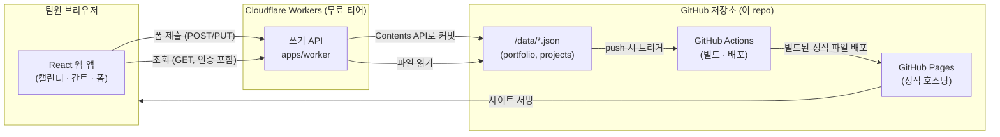

# 프로젝트 관리 포트폴리오 솔루션

[](https://github.com/songwri/project-management-solution/actions/workflows/deploy.yml)

동시에 진행되는 여러 프로젝트의 **세부 일정**과 **포트폴리오(통합) 일정**을
캘린더/간트 차트로 시각화하고, 프로젝트별로 개요·범위·회의록·산출물·진행
현황을 관리하다가 **산출물 등록으로 프로젝트를 종료**하는 흐름까지 지원하는
사내 도구입니다.

데이터는 이 GitHub 저장소 자체를 데이터베이스로 사용합니다 (`/data`). 별도
DB나 새 SaaS 도입 없이, 회사에서 이미 원활히 쓰는 GitHub 인프라만으로
운영·배포·백업이 가능하도록 설계했습니다.

## 주요 기능

- **포트폴리오 대시보드**: 전체 프로젝트의 일정을 하나의 캘린더/간트에
  프로젝트별 색상으로 겹쳐서 표시. 상태별 필터링.
- **프로젝트 상세**: 개요·범위 / 일정(캘린더·간트 전환) / 회의록 / 산출물
  4개 탭으로 구성.
- **산출물 등록 → 종료**: 산출물을 1건 이상 등록해야 프로젝트를 "종료"
  상태로 바꿀 수 있는 게이트를 둠.
- 비개발자도 웹 폼만으로 입력하며, 저장 시 자동으로 GitHub에 커밋됨
  (Git/GitHub 지식 불필요).

## 스크린샷

`apps/web`을 `npm run dev`로 실행하면 아래와 같은 화면을 바로 확인할 수
있습니다 (예시 데이터 5건 포함, 별도 설정 없이 "데모 모드"로 동작).

## 아키텍처



- **읽기/쓰기**: 웹 앱은 항상 Worker를 거쳐 GitHub `/data`를 읽고 씁니다.
  Worker만 GitHub 쓰기 토큰을 갖고 있어 브라우저에 자격 증명이 노출되지
  않습니다.
- **저장 = git 커밋**: 모든 저장은 "누가/언제/무엇을 바꿨는지"가 git
  히스토리에 그대로 남는 하나의 커밋입니다. 별도 감사 로그가 필요 없습니다.
- **백업/복구**: 저장소 자체가 백업입니다. 실수로 잘못 저장해도 이전
  커밋으로 되돌리면 됩니다.
- **호스팅**: 프런트엔드는 GitHub Pages, 쓰기 API만 Cloudflare Workers.
  둘 다 무료 티어로 충분한 규모(5~15개 프로젝트, 10~30인)를 가정했습니다.

배포를 전혀 하지 않아도 `apps/web`을 로컬에서 `npm run dev`로 띄우면
번들된 예시 데이터로 전체 기능(캘린더/간트/회의록/산출물/종료 처리)을
브라우저 localStorage 기반 "데모 모드"로 바로 체험할 수 있습니다.

왜 이런 구조를 선택했는지(대안 검토 포함)는
[docs/DEPLOYMENT.md](docs/DEPLOYMENT.md)에 정리했습니다.

## 저장소 구조

```
apps/
  web/      # React + TypeScript + Vite 프런트엔드 (캘린더·간트·폼)
  worker/   # Cloudflare Worker — GitHub Contents API로 쓰기 처리
data/       # 실제 데이터 (portfolio.json, projects/*.json) — 이 repo가 DB
docs/       # 데이터 모델, 배포 가이드
.github/workflows/
  deploy.yml  # main 브랜치 → GitHub Pages 자동 배포
  ci.yml      # 그 외 브랜치/PR → 빌드 검증
```

## 빠른 시작 (로컬)

```bash
cd apps/web
npm install
npm run seed:sync   # /data 예시 데이터를 public/data로 동기화
npm run dev
```

## 문서

- [docs/DATA_MODEL.md](docs/DATA_MODEL.md) — JSON 데이터 스키마
- [docs/DEPLOYMENT.md](docs/DEPLOYMENT.md) — GitHub Pages + Cloudflare
  Worker 배포 절차와 설계 근거
- [apps/worker/README.md](apps/worker/README.md) — Worker API 상세

## 로드맵 / 확장 시 고려사항

- **인증**: 현재는 팀 공용 "접속 코드" 1개로 쓰기를 보호합니다. 회사가
  이미 Microsoft 365/Teams를 쓰므로, 다음 단계로는 Microsoft Entra ID
  (Azure AD) SSO를 Worker에 붙여 개인별 로그인으로 전환하는 것을
  권장합니다.
- **대용량 산출물**: 수 MB를 넘는 파일은 git에 직접 커밋하지 말고 회사
  SharePoint/Teams에 올린 뒤 링크만 등록하세요 (`docs/DATA_MODEL.md` 참고).
- **규모 확장**: 수십~수백 개 프로젝트, 초 단위 동시 편집이 필요해지면
  GitHub-as-DB의 한계(커밋 기반 쓰기의 지연/충돌)에 도달합니다. 이 경우
  Worker 뒤에 Postgres 등 실제 DB를 두고 GitHub는 감사 로그/백업 용도로
  전환하는 마이그레이션을 권장합니다 — API 경계(Worker)가 이미 분리되어
  있어 프런트엔드 변경 없이 가능합니다.
